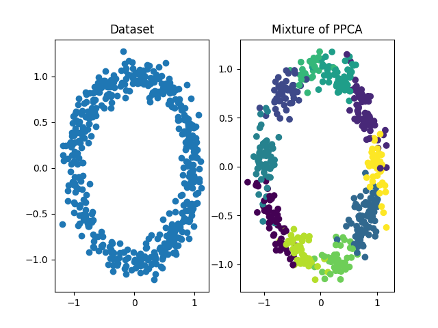
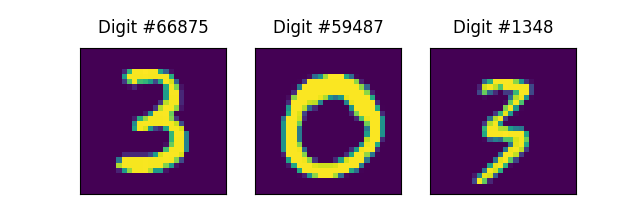
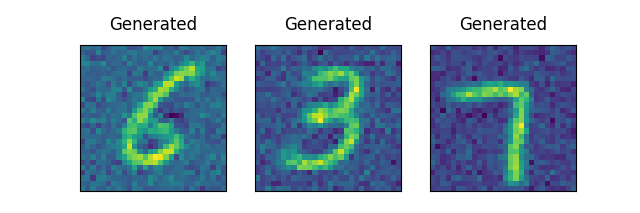
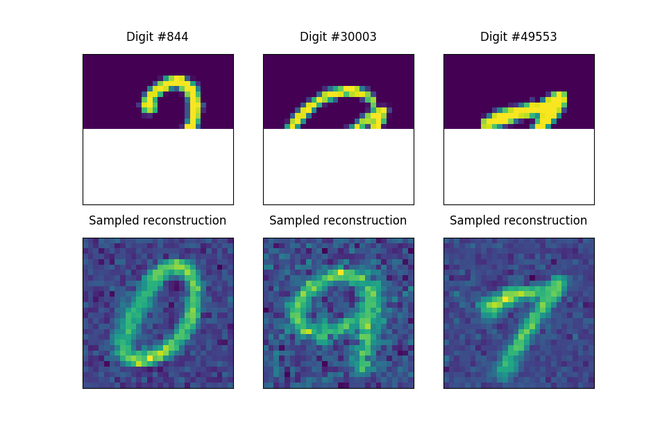
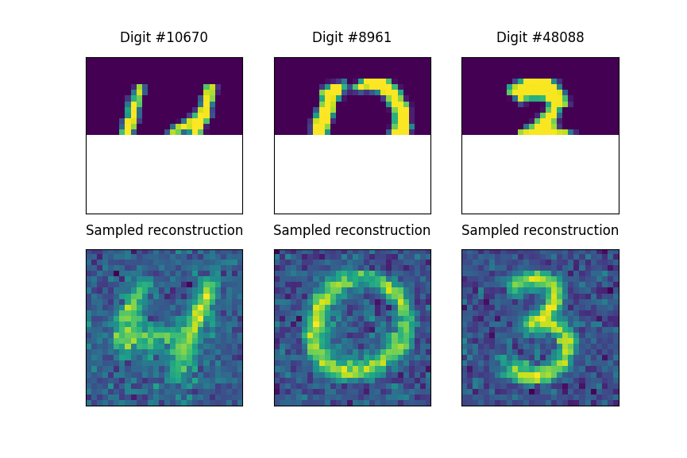

Mixture of Probabilistic Principal Component Analysis (MPPCA)
=============================================================

Installation
------------

First, copy the content of the repository in your favourite location

```console
git clone fuffa
cd MPPCA
```

then navigate in ``cmixture`` and compile the ``cython`` script

```console
cd mppca/cmixture
python setup.py build_ext --inplace
```

Lastly, install the library

```console
cd ../..
pip install -e .
```

A first example with circular data
----------------------------------

Let us generate some data with a circular shape

```python
n_samples = 500

theta = np.random.uniform(-np.pi, np.pi, size=n_samples)
x_1 = np.sin(theta)
x_2 = np.cos(theta)
r = np.random.normal(scale=0.1, size=n_samples) + 1.
X = np.array([x_1 * r, x_2 * r]).T
```

Now, we can train our MPPCA model using 10 clusters and 1 latent space per cluster 

```python
mppca = MPPCA(10, 1, n_iterations=10)
mppca.fit(X)
```

The resulting reconstruction is



An example with MNIST
---------------------

Let us take a dataset of 70000 images of (28, 28), which can see as vectors of 784 numbers.
We can train our model using 100 clusters (the digits are highly non-linear) and for each cluster a latent dimension of 10.
Each digit, in our model, can be identified with 11 numbers, one that identifies the cluster and the ten digit of the latent space.
After fitting our model, we want to compare the digit in the dataset and the generated ones




A more exciting feature, is the possibility to query our model giving only a partial image, and asking it to reconstruct it.

```python
rec_X = mppca.reconstruction(X[indx, :14*28], np.array(range(14*28)))
```

``X[indx, :14:28]`` shows only the first 14 rows of the image, and ``np.array(range(14*28))`` tells to the model that we are showing
the first ``14*28`` indexes. The method ``mppca.reconstruction`` will output a plausible image that matches with the shown one.






